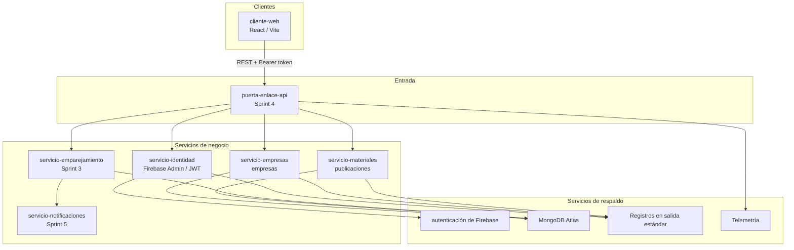

# EcoRed Circular — Product Backlog y planificación nativa de la nube

**Producto:** EcoRed Circular  
**Tipo de proyecto:** Continuación de la aplicación desarrollada en clase  
**Enfoque:** Aplicación nativa de la nube (microservicios, contenedores, APIs REST, persistencia externa, autenticación, configuración externa, observabilidad y 15 factores)  
**Herramienta de gestión:** Azure DevOps Boards (alternativa: Jira)  
**Duración de sprint sugerida:** 2 semanas  
**Equipo:** máximo 4 integrantes

---

## 1. Visión del producto

EcoRed Circular es una plataforma de economía circular que conecta empresas para publicar, descubrir e intercambiar materiales reciclables o reutilizables.

El incremento de clase ya permite autenticar usuarios, registrar empresas y publicar materiales propios. La lista de producto lleva ese núcleo a un producto nativo de la nube: servicios independientes, contratos API, persistencia en MongoDB Atlas, identidad con Firebase, configuración por entorno, contenedores y telemetría.

---

## 2. Cobertura del enunciado

| Requisito | Cómo se cubre |
|---|---|
| Arquitectura de microservicios | Épica E5 + diagrama (puerta de enlace, identidad, empresas, materiales, emparejamiento) |
| Servicios contenerizados | US-07, US-23, US-25, US-26 |
| APIs REST | Todas las historias de negocio; funcionalidad F11 |
| Persistencia externa | MongoDB Atlas (servicio de respaldo) en E2, E3, E4 |
| Autenticación y autorización | Épica E1 (US-01, US-02, US-08, US-09) |
| Configuración externa | US-07, funcionalidad F9 |
| Observabilidad y telemetría | Épica E6 (US-07, US-21, US-22, US-26) |
| 15 factores | Matriz de la sección 8 |
| ≥ 5 épicas | 6 |
| ≥ 10 funcionalidades | 12 |
| ≥ 20 historias | 30 |
| Sprint 1: 5–8 historias | 7 historias (US-01 a US-07) |
| Incremento cliente web + backend + persistencia + autenticación | Sprint 1 |
| 2 módulos de negocio | Empresas y materiales |

---

## 3. Actores

| Actor | Descripción |
|---|---|
| Visitante | Usuario no autenticado |
| Empresario | Usuario autenticado que registra empresas y publica materiales |
| Interesado | Empresario que consulta el catálogo y solicita materiales de terceros |
| Operador | Integrante del equipo que despliega, configura y observa los servicios |

---

## 4. Épicas (6)

| ID | Épica | Objetivo | Microservicios | Factores |
|---|---|---|---|---|
| E1 | Identidad y acceso | Registrar, autenticar y autorizar usuarios | servicio-identidad, cliente-web | 5, 15 |
| E2 | Gestión de empresas | CRUD de empresas con tenencia por usuario | servicio-empresas | 2, 8, 15 |
| E3 | Publicaciones de materiales | Publicar, consultar y gestionar el ciclo de vida de materiales | servicio-materiales | 2, 8, 15 |
| E4 | Mercado circular | Catálogo público, solicitudes e intercambio | servicio-emparejamiento, servicio-materiales | 2, 8, 13, 15 |
| E5 | Plataforma nativa de la nube | Contenedores, configuración, puerta de enlace, integración continua y paridad de entornos | puerta-enlace-api, plataforma | 1, 3, 4, 5, 7, 9, 11, 12, 13 |
| E6 | Observabilidad y operaciones | Registros, métricas, trazas, salud y procesos administrativos | todos | 6, 7, 10, 14 |

---

## 5. Funcionalidades (12)

| ID | Funcionalidad | Épica | Descripción |
|---|---|---|---|
| F1 | Autenticación de usuarios | E1 | Inicio de sesión con correo/contraseña y proveedor externo |
| F2 | Autorización y tenencia | E1 | Token Bearer, rutas protegidas y aislamiento por `uid` |
| F3 | Registro y consulta de empresas | E2 | Crear y listar empresas del usuario autenticado |
| F4 | Administración de empresas | E2 | Editar, eliminar y ver detalle de empresa |
| F5 | Publicación de materiales | E3 | Crear publicaciones asociadas a una empresa propia |
| F6 | Ciclo de vida de materiales | E3 | Editar, cambiar estado y consultar publicaciones propias |
| F7 | Catálogo público y búsqueda | E4 | Descubrir materiales de otras empresas con filtros |
| F8 | Solicitudes de intercambio | E4 | Pedir, aceptar, rechazar y cerrar un intercambio |
| F9 | Configuración y secretos | E5 | Variables de entorno; ningún secreto en el código |
| F10 | Contenerización y orquestación | E5 | Imágenes Docker y ejecución local reproducible |
| F11 | Contratos API y puerta de enlace | E5 | APIs REST versionadas y puerta de entrada única |
| F12 | Telemetría, registros y salud | E6 | Salud, registros en la salida estándar, métricas y trazas |

---

## 6. Lista de producto (Product Backlog) (30 historias)

Convenciones:

- **Prioridad:** 1 = Debe (crítico), 2 = Debería, 3 = Podría
- **Estimación:** puntos Fibonacci
- **Sprint propuesto:** 1 a 5
- **Historia:** Como [actor], quiero [funcionalidad], para [beneficio]

### 6.1 Sprint 1 — Incremento mínimo nativo de la nube (7 historias)

Los criterios de aceptación completos (éxito, validaciones, errores, autenticación y reglas de negocio) están en `02-historias-sprint-1.md`.

| ID | Funcionalidad | Historia | Pri | SP | Microservicio | Factores |
|---|---|---|---|---|---|---|
| US-01 | F1 | Como empresario, quiero iniciar sesión con correo y contraseña, para acceder de forma segura a mis empresas y materiales. | 1 | 5 | servicio-identidad, cliente-web | 5, 15 |
| US-02 | F2 | Como empresario, quiero que la API valide mi token y aísle mis datos, para que nadie más consulte o modifique mi información. | 1 | 5 | servicio-identidad, servicio-empresas, servicio-materiales | 2, 12, 15 |
| US-03 | F3 | Como empresario, quiero registrar mi empresa (nombre, NIT, ciudad, sector, descripción y comunidad), para asociar publicaciones de materiales a un actor formal. | 1 | 5 | servicio-empresas, cliente-web | 2, 5, 8, 15 |
| US-04 | F3 | Como empresario, quiero consultar las empresas que yo registré, para verificar y reutilizar esos datos al publicar materiales. | 1 | 3 | servicio-empresas, cliente-web | 2, 8, 15 |
| US-05 | F5 | Como empresario, quiero publicar un material reciclable asociado a una de mis empresas, para ofrecer excedente a la red circular. | 1 | 5 | servicio-materiales, cliente-web | 2, 8, 15 |
| US-06 | F6 | Como empresario, quiero ver las publicaciones de materiales de mis empresas, para conocer el inventario que tengo en la plataforma. | 1 | 3 | servicio-materiales, cliente-web | 2, 8, 15 |
| US-07 | F9, F10, F12 | Como operador, quiero configurar la aplicación con variables de entorno, ejecutarla en contenedores y verificar su salud, para correr el mismo incremento en local sin secretos en el código. | 1 | 8 | plataforma, cliente-web, servicio-empresas, servicio-materiales | 3, 4, 5, 7, 8, 9, 11, 14 |

**Capacidad Sprint 1:** 34 puntos.

### 6.2 Sprint 2 — Completar módulos y robustez (8 historias)

| ID | Funcionalidad | Historia | Pri | SP | Microservicio | Factores |
|---|---|---|---|---|---|---|
| US-08 | F1 | Como visitante, quiero crear una cuenta con correo y contraseña, para usar la plataforma sin depender de un usuario preexistente. | 2 | 5 | servicio-identidad, cliente-web | 5, 15 |
| US-09 | F1 | Como empresario, quiero iniciar sesión con Google, para autenticarme más rápido. | 2 | 3 | servicio-identidad, cliente-web | 5, 8, 15 |
| US-10 | F4 | Como empresario, quiero editar los datos de una empresa mía, para mantener la información actualizada. | 2 | 3 | servicio-empresas | 2, 15 |
| US-11 | F4 | Como empresario, quiero eliminar una empresa mía, para retirar actores que ya no participan. | 2 | 3 | servicio-empresas | 2, 15 |
| US-12 | F6 | Como empresario, quiero editar una publicación de material mía, para corregir cantidad, precio o ubicación. | 2 | 3 | servicio-materiales | 2, 15 |
| US-13 | F6 | Como empresario, quiero cambiar el estado de un material (disponible, reservado, intercambiado), para reflejar su ciclo de vida. | 2 | 5 | servicio-materiales | 2, 15 |
| US-14 | F4, F6 | Como empresario, quiero ver el detalle de una empresa y de un material, para revisar la información completa antes de operar. | 2 | 3 | servicio-empresas, servicio-materiales | 2 |
| US-15 | F2, F11 | Como empresario, quiero que la API rechace datos inválidos y acciones sobre recursos ajenos, para no corromper el negocio ni cruzar tenencias. | 2 | 5 | servicio-empresas, servicio-materiales | 2, 15 |

### 6.3 Sprint 3 — Mercado circular (5 historias)

| ID | Funcionalidad | Historia | Pri | SP | Microservicio | Factores |
|---|---|---|---|---|---|---|
| US-16 | F7 | Como interesado, quiero ver un catálogo de materiales disponibles de otras empresas, para encontrar recursos reutilizables. | 2 | 8 | servicio-materiales, cliente-web | 2, 15 |
| US-17 | F7 | Como interesado, quiero filtrar el catálogo por tipo, ciudad y rango de precio, para acotar resultados útiles. | 2 | 5 | servicio-materiales | 2, 13 |
| US-18 | F8 | Como interesado, quiero solicitar un material disponible, para iniciar un intercambio con su publicador. | 2 | 8 | servicio-emparejamiento | 2, 8, 15 |
| US-19 | F8 | Como empresario, quiero aceptar o rechazar solicitudes sobre mis materiales, para controlar con quién intercambio. | 2 | 5 | servicio-emparejamiento | 2, 15 |
| US-20 | F8 | Como empresario, quiero marcar un intercambio como cerrado, para retirar el material del catálogo y dejar trazabilidad. | 2 | 5 | servicio-emparejamiento, servicio-materiales | 2, 8, 12 |

### 6.4 Sprint 4 — Plataforma nativa de la nube (6 historias)

| ID | Funcionalidad | Historia | Pri | SP | Microservicio | Factores |
|---|---|---|---|---|---|---|
| US-21 | F12 | Como operador, quiero registros estructurados en la salida estándar de cada servicio, para diagnosticar sin entrar al contenedor. | 2 | 5 | todos | 6, 14 |
| US-22 | F12 | Como operador, quiero métricas y trazas de las APIs (latencia, errores, correlación), para observar el sistema en la nube. | 2 | 8 | todos | 14 |
| US-23 | F10, F11 | Como operador, quiero separar empresas y materiales en microservicios contenerizados, para desplegarlos y escalarlos de forma independiente. | 2 | 13 | servicio-empresas, servicio-materiales | 1, 2, 7, 12, 13 |
| US-24 | F11 | Como cliente web, quiero consumir los servicios a través de una puerta de enlace de API, para unificar autenticación, enrutamiento y CORS. | 2 | 8 | puerta-enlace-api | 2, 11, 15 |
| US-25 | F10 | Como operador, quiero un canal de diseño, compilación, publicación y ejecución, para publicar artefactos inmutables con la misma receta en local y nube. | 2 | 8 | plataforma | 3, 4, 9 |
| US-26 | F10, F12 | Como operador, quiero sondas de actividad y de preparación, para que el orquestador reinicie o retire instancias no saludables. | 3 | 3 | todos | 7, 11, 14 |

### 6.5 Sprint 5 — Diferenciación (4 historias)

| ID | Funcionalidad | Historia | Pri | SP | Microservicio | Factores |
|---|---|---|---|---|---|---|
| US-27 | F7 | Como interesado, quiero recibir sugerencias de materiales según ciudad y tipo, para descubrir intercambios viables más rápido. | 3 | 8 | servicio-emparejamiento | 2, 13 |
| US-28 | F8 | Como empresario, quiero recibir notificaciones de nuevas solicitudes, para responder sin vigilar el tablero. | 3 | 8 | servicio-notificaciones | 2, 6, 14 |
| US-29 | F6 | Como empresario, quiero ver el impacto estimado (kg reutilizados) de mis intercambios, para evidenciar el valor circular. | 3 | 5 | servicio-materiales | 2, 14 |
| US-30 | F9 | Como operador, quiero ejecutar un proceso administrativo de carga inicial sin acoplarlo al proceso web en ejecución, para cargar datos de demostración de forma repetible. | 3 | 2 | plataforma | 10 |

**Total de la lista de producto:** 30 historias · **152 puntos**.

---

## 7. Objetivo del Sprint 1

> Entregar un incremento funcional completo, ejecutable en local (Docker + variables de entorno), en el que un empresario autenticado registra empresas, publica materiales y consulta ambos módulos contra APIs REST persistidas en MongoDB Atlas.

### Incremento esperado (Definición de terminado del sprint)

- Frontend y backend integrados.
- Autenticación Firebase (correo/contraseña) y autorización por token en las APIs de negocio.
- Dos entidades de negocio: **empresa** y **material**.
- Registro y consulta de ambas entidades.
- Persistencia en MongoDB Atlas (servicio externo).
- Configuración por variables de entorno.
- Comprobación de salud pública.
- Ejecución local verificable (`docker compose up` y/o cliente web + backend).
- Sin secretos embebidos en el código.

### Fuera de alcance del Sprint 1

Editar/eliminar, catálogo público, solicitudes, separación física de microservicios, métricas avanzadas, registro de cuenta nuevo (si el equipo ya usa usuarios Firebase de clase, US-08 queda en Sprint 2).

---

## 8. Diagrama preliminar de microservicios

En Sprint 1 el backend puede vivir como **monolito modular** (Django con módulos de empresas y materiales más una capa intermedia de identidad). El diagrama muestra la arquitectura **objetivo**. Lo que el Sprint 1 debe dejar funcionando de punta a punta se detalla en la tabla siguiente.



### Alcance Sprint 1 vs. objetivo

| Componente | Sprint 1 | Objetivo (Sprint 4–5) |
|---|---|---|
| cliente-web | Sí | Sí |
| Identidad (Firebase + validación de token) | Sí, como capa intermedia del backend | Servicio de identidad en la puerta de enlace |
| servicio-empresas | Módulo / API REST | Contenedor propio |
| servicio-materiales | Módulo / API REST | Contenedor propio |
| puerta-enlace-api | No (el cliente web llama al backend) | Sí |
| servicio-emparejamiento | No | Sí |
| servicio-notificaciones | No | Sí |
| MongoDB Atlas | Sí | Sí |
| Autenticación Firebase | Sí | Sí |
| Docker | Backend contenerizado + Compose | Un contenedor por servicio |
| Salud | `GET /api/health/` | Actividad y preparación por servicio |

### Contratos REST del Sprint 1

| Método | Ruta | Autenticación | Recurso |
|---|---|---|---|
| GET | `/api/health/` | Pública | Salud |
| GET | `/api/companies/` | Bearer | Empresas del `uid` |
| POST | `/api/companies/` | Bearer | Crear empresa |
| GET | `/api/materials/` | Bearer | Materiales de empresas del `uid` |
| POST | `/api/materials/` | Bearer | Crear publicación |

---

## 9. Matriz lista de producto ↔ 15 factores nativos de la nube

Factores según *Beyond the Twelve-Factor App* (Kevin Hoffman), referenciados en el libro de Azure [Aplicaciones nativas de la nube](https://learn.microsoft.com/es-es/dotnet/architecture/cloud-native/definition).

| # | Factor | Qué implica en EcoRed | Historias / funcionalidades |
|---|---|---|---|
| 1 | Un código base, una aplicación | Un repositorio; cada microservicio es una aplicación con su propio código | US-23, E5 |
| 2 | API primero | Toda interacción de negocio pasa por REST; el cliente web es un consumidor más | US-02 a US-06, US-10 a US-20, US-24, F11 |
| 3 | Gestión de dependencias | Dependencias declaradas (`requirements`, `package.json`, imagen Docker) | US-07, US-25 |
| 4 | Diseño, compilación, publicación y ejecución | Imagen versionada (`ecored-circular:v1.0`); la compilación se separa de la ejecución | US-07, US-25 |
| 5 | Configuración, credenciales y código | `.env` / variables de entorno; secretos fuera del código | US-01, US-03, US-07, F9 |
| 6 | Registros | Eventos como flujo hacia la salida estándar, no archivos locales | US-21, US-28 |
| 7 | Desechabilidad | Contenedores que arrancan y mueren rápido; políticas de reinicio | US-07, US-23, US-26 |
| 8 | Servicios de respaldo | MongoDB Atlas y Firebase como recursos conectables por URL o credencial | US-03 a US-06, US-09, US-18, US-20 |
| 9 | Paridad de entornos | Misma receta en local y en la nube (Compose / canal de integración) | US-07, US-25 |
| 10 | Procesos administrativos | Carga inicial y tareas independientes fuera de la petición HTTP | US-30 |
| 11 | Enlace de puertos | El servicio se expone por puerto (`8080:10000`, Vite, puerta de enlace) | US-07, US-24, US-26 |
| 12 | Procesos sin estado | Estado en MongoDB o Firebase, no en la memoria del proceso | US-02, US-20, US-23 |
| 13 | Concurrencia | Escalar instancias de catálogo y emparejamiento de forma independiente | US-17, US-23, US-27 |
| 14 | Telemetría | Salud, métricas, trazas y diagnóstico de arranque | US-07, US-21, US-22, US-26, US-29 |
| 15 | Autenticación y autorización | Identidad desde el Sprint 1; control de acceso y tenencia por `uid` | US-01, US-02, US-08, US-09, US-15, US-16, US-24 |

### Cobertura: cada factor tiene al menos una historia

| Factor | 1 | 2 | 3 | 4 | 5 | 6 | 7 | 8 | 9 | 10 | 11 | 12 | 13 | 14 | 15 |
|---|---|---|---|---|---|---|---|---|---|---|---|---|---|---|---|
| Cubierto | Sí | Sí | Sí | Sí | Sí | Sí | Sí | Sí | Sí | Sí | Sí | Sí | Sí | Sí | Sí |
| En Sprint 1 | Parcial (monolito modular) | Sí | Sí | Sí | Sí | Mínimo | Sí | Sí | Sí | No (US-30) | Sí | Sí | No | Salud | Sí |

---

## 10. Mapa de sprints

| Sprint | Meta | Historias | Puntos | Incremento |
|---|---|---|---|---|
| 1 | Incremento autenticado, 2 entidades, configuración, contenedor | US-01 … US-07 | 34 | Aplicación usable de punta a punta |
| 2 | Alta, consulta, edición y validaciones de negocio | US-08 … US-15 | 30 | Módulos de empresa y material cerrados |
| 3 | Mercado circular | US-16 … US-20 | 31 | Intercambio entre empresas |
| 4 | Plataforma nativa de la nube | US-21 … US-26 | 45 | Microservicios, puerta de enlace, telemetría, integración continua |
| 5 | Diferenciación | US-27 … US-30 | 23 | Emparejamiento, notificaciones, impacto |

---

## 11. Criterios de aceptación — plantilla

Todas las historias usan:

> Como [actor], quiero [funcionalidad], para [beneficio].

Y escenarios:

```
Dado que [condición inicial]
Cuando [acción]
Entonces [resultado esperado]
```

Las 7 historias del Sprint 1 incluyen, cada una:

1. Escenario exitoso  
2. Validaciones  
3. Manejo de errores  
4. Restricciones de autenticación o autorización  
5. Reglas de negocio  

Ver documento `02-historias-sprint-1.md`.

---

## 12. Definición de terminado (equipo)

Una historia no se cierra si falta alguno de estos puntos:

- Código en el repositorio de la historia, sin secretos.
- API o pantalla verificable en local.
- Criterios Dado que / Cuando / Entonces cumplidos.
- Variables de entorno documentadas si la historia las usa.
- Evidencia breve (captura o colección HTTP).
- Ítem movido a **Terminado** en el tablero del sprint.
